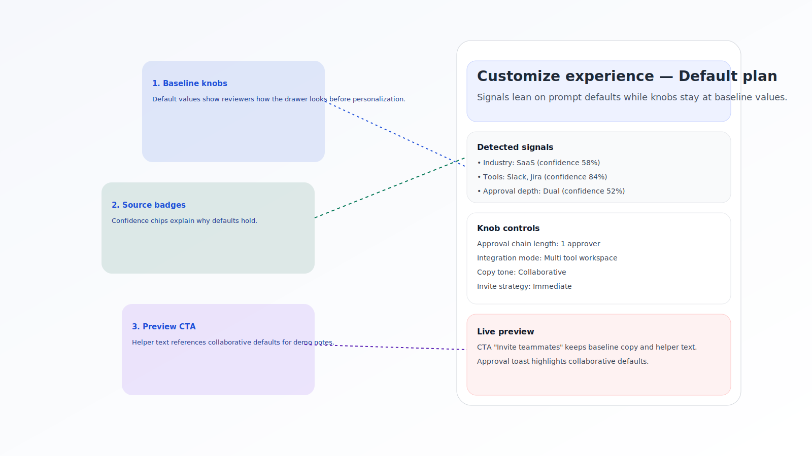
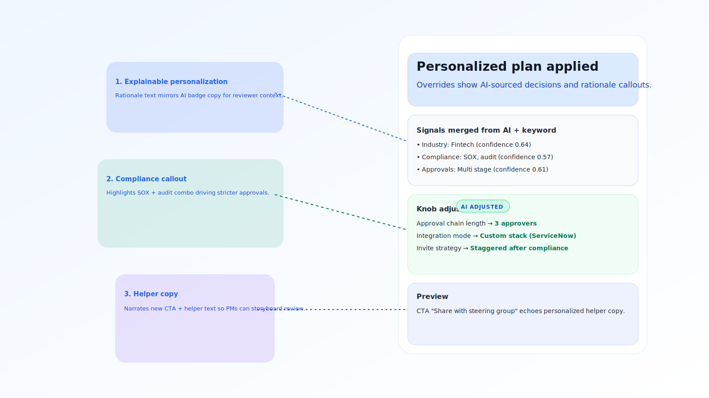
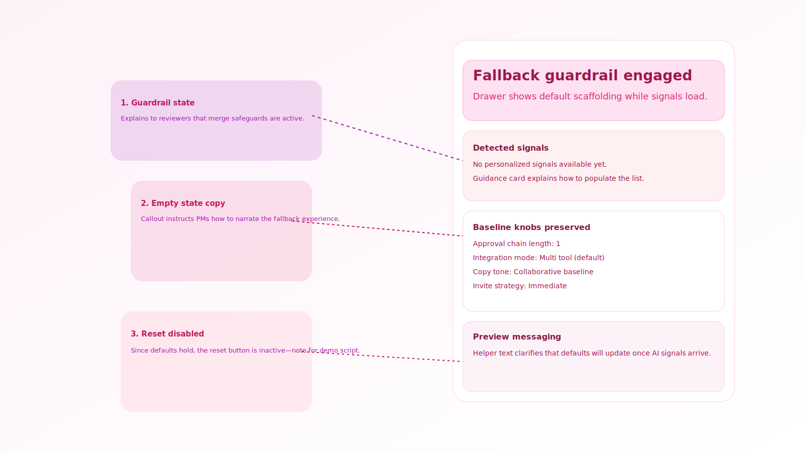
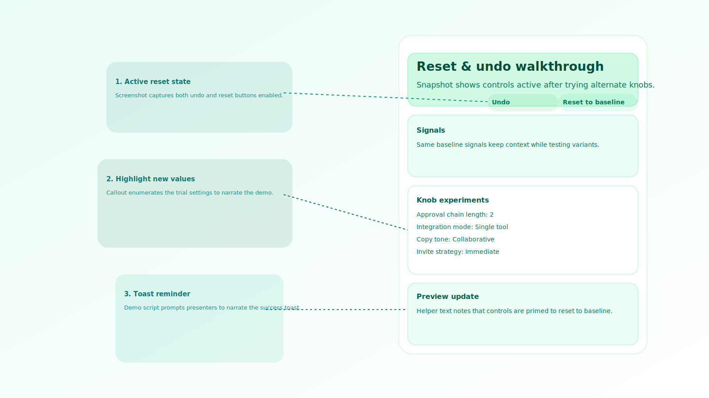

# Phase 4 Demo Script — Customize Drawer Acceptance

This script packages the acceptance evidence requested in PLAN4-17 so stakeholders can review personalization behaviors without running the Next.js app. Pair the Storybook stories with the annotated screenshots in `docs/assets/phase4/` to narrate the adaptive journey.

## Storybook References

1. **Default Plan** — `Canvas/CustomizeDrawer/DefaultPlan`
   - URL: `http://localhost:6006/?path=/story/canvas-customizedrawer--default-plan`
   - Emphasise that signals come from keywords and the knobs stay on baseline settings. Point out the helper annotation rendered inside the story frame.
2. **Personalized Plan** — `Canvas/CustomizeDrawer/PersonalizedPlan`
   - URL: `http://localhost:6006/?path=/story/canvas-customizedrawer--personalized-plan`
   - Walk through each override and the AI badge, explaining how compliance + tool signals tightened approvals and changed the CTA.
3. **Fallback Signals** — `Canvas/CustomizeDrawer/FallbackSignals`
   - URL: `http://localhost:6006/?path=/story/canvas-customizedrawer--fallback-signals`
   - Call out the empty-state card and note that reset is disabled while defaults hold.
4. **Reset Flow** — `Canvas/CustomizeDrawer/ResetFlow`
   - URL: `http://localhost:6006/?path=/story/canvas-customizedrawer--reset-flow`
   - Demo the undo/reset pairing; hover the buttons during walkthrough to show focus states.

_Run your Storybook dev server (for example `bunx storybook dev -p 6006`) or review the Chromatic build once synced._

## Annotated Screenshots

Use the following assets in decks or asynchronous updates. Each file includes callouts summarising the talking points above.

- 
- 
- 
- 

## Delivery Notes

- Open with the default plan story so stakeholders see the unmodified baseline before toggling personalization.
- When narrating the personalized plan, reference the prompt signals listed in the drawer to tie the story back to persona inputs.
- For the fallback capture, reassure reviewers that confidence guardrails prevent low-signal prompts from applying risky overrides.
- Close on the reset flow to demonstrate how PMs can recover from over-tuning and how the toast confirms the action for auditability.
